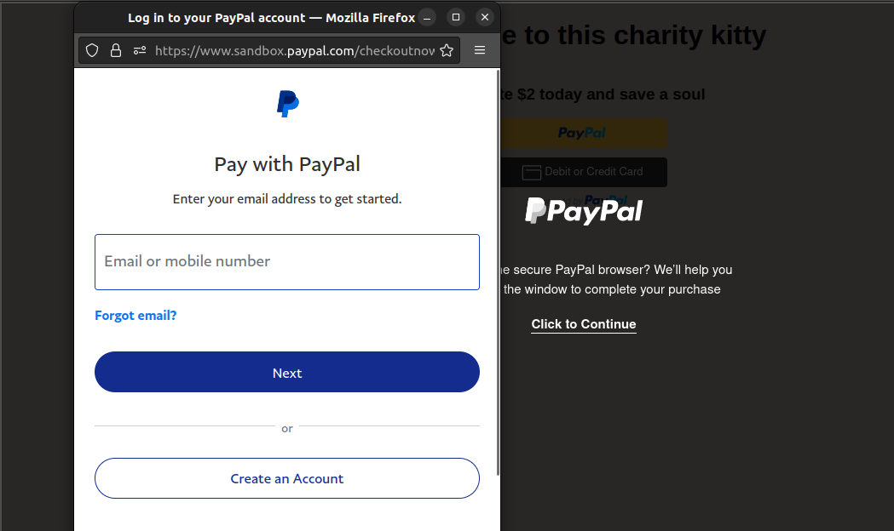

# Life-Kitty

## Payment Integration Website with PayPal

Welcome to this Payment Integration Website, which allows you to seamlessly accept payments using PayPal. This `README.md` file provides essential information about how to navigate the website, tools used, and other important details.

### Table of Contents

- [Navigation](#navigation)
- [Tools Used](#tools-used)
- [Setup and Installation](#setup-and-installation)
- [Usage](#usage)
- [Contributing](#contributing)
<!-- - [License](#license) -->

### Navigation

To navigate the Payment Integration Website, follow these steps:

1. **Homepage:** Visit the website's homepage to explore our products.
2. **Product Selection:** Browse and select the product or service you want to purchase. There is currently only one product, donation.
3. **Checkout:** Proceed to the checkout page.
4. **Payment:** On the checkout page, select the PayPal payment option.
5. **PayPal Integration:** You will be redirected to the PayPal payment gateway, where you can securely complete your transaction.
6. **Order Confirmation:** After a successful payment, you will receive an order confirmation and receipt.

### Tools Used

The following technologies and tools were used in the development of this website:

- **HTML/CSS/JavaScript:** The core web technologies used for building the frontend.
- **Libraries & Frameworks:** React.js, jsPDF, nodemailer.
- **PayPal Integration:** The PayPal payment gateway for processing payments securely.
- **Version Control:** Git & GitHub.
- **Deployment:** Vercel.

### Setup and Installation

If you want to set up a local development environment, follow these steps:

1. Clone this repository to your local machine using Git.

- `git clone <remote url>`

2. Install any dependencies.

- `npm install/npm i`

3. Configure your PayPal API credentials.

- `Create a developer account on paypal for testing`

4. Start the development server.

- `npm start/npm run start`

5. Access the website through your browser

- `http://localhost:<port no.>.`

### Usage

- The application has one page, with a donate button in the welcome page.
  
- Clicking on the button displays the PayPal button with PayPal & Debit Card modes of payment.
  
- Clicking PayPal option triggers a login page. Login with your PayPal developer account.
  
- Default donation amount = $2. Confirm payment.

### Contributing

- Be free to open any issue on the repositiory.

<!-- ### License -->

---
